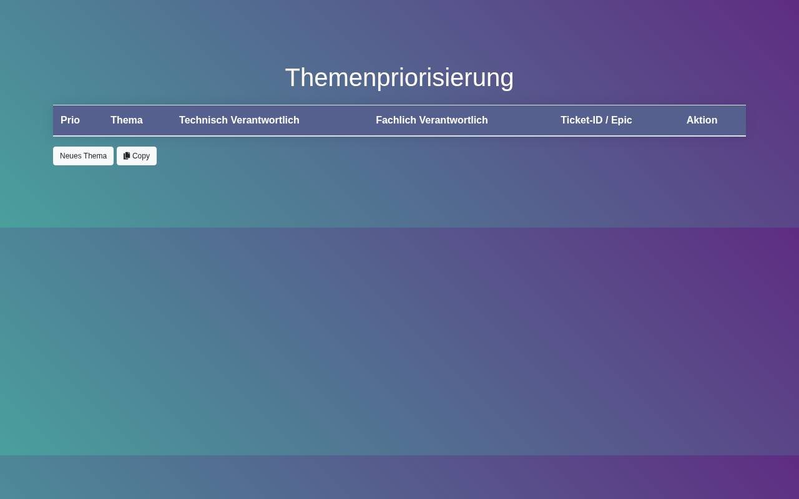

# Flexible Prioritization Table

A single-page, editable table for prioritizing topics or projects: reorder rows, assign technical and functional owners, link tickets, strike through finished items, put items on hold and copy the whole table into Confluence or SharePoint. The UI is in German.

**Live:** [flexible-priorization-table.weisser.dev](https://flexible-priorization-table.weisser.dev)



Known issue: the column context menu is currently buggy; everything else works.

## Run locally

Static page without build step. Open `index.html` in a browser (Bootstrap, Font Awesome, jQuery and Popper are loaded from CDNs, so an internet connection is needed), or:

```bash
python3 -m http.server 8080
```

## Tech stack

HTML, CSS, JavaScript (`script.js`, `styles.css`), Bootstrap 4, jQuery, Font Awesome.

## Table Features

-   **Flexible Prioritization:** You can easily change the priority of items by moving them up or down the list.
-   **Copy Functionality:** You can copy the entire table for sharing and inserting into various platforms like Confluence and SharePoint.
-   **Strikethrough:** You can mark completed items by striking through them.
-   **On-Hold Status:** You can temporarily put items on hold and later resume them.

## Table Structure

The Prioritization Table consists of the following columns:

1.  **Priority (Prio):** Indicates the priority of the item using icons (exclamation triangle, arrow up, etc.).
2.  **Topic (Thema):** Describes the task or project.
3.  **Technical Responsible (Technisch Verantwortlich):** Specifies the person responsible for technical aspects.
4.  **Functional Responsible (Fachlich Verantwortlich):** Specifies the person responsible for functional aspects.
5.  **Ticket-ID / Epic:** Contains a link to the corresponding ticket or epic.
6.  **Action (Aktion):** Allows you to perform actions like moving rows, striking through, and deleting.

## Usage

### Changing Priority

-   To change the priority of an item, click the "Up" or "Down" arrow buttons in the "Aktion" column.

### Copying the Table

-   To copy the entire table, click the "Copy" button. The table will be copied to your clipboard, ready to be pasted elsewhere.

### Strikethrough

-   To mark an item as completed, click the "Trash" button in the "Aktion" column to strike through the item.

### On-Hold Status

-   To put an item on hold, click the "On Hold setzen" button in the context menu. The priority icon will change, and the item will be on hold. Click "Fortsetzen" to resume it.

### Adding Rows

-   To add a new row, click the "Neues Thema" button. Customize the new row as needed.

### Context Menu

-   Right-click on a row or header to access the context menu. This menu provides additional options such as adding rows above or below, moving rows, deleting rows, and more.

## Customization

-   You can customize the table's appearance and behavior by modifying the provided CSS and JavaScript files (`styles.css` and `script.js`).

## Compatibility

-   The table is designed to be responsive and should work well on both desktop and mobile devices.

## Note

-   Ensure that you have the necessary permissions to copy, edit, and manage the table content.

Feel free to adapt and use this Prioritization Table to manage your projects or tasks effectively. If you encounter any issues or have suggestions for improvement, please refer to the provided JavaScript and CSS files for customization and make the changes accordingly.
